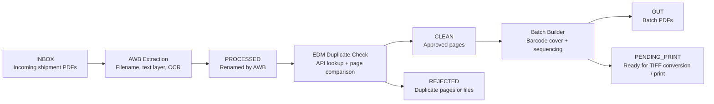
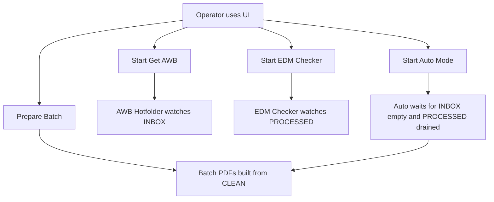
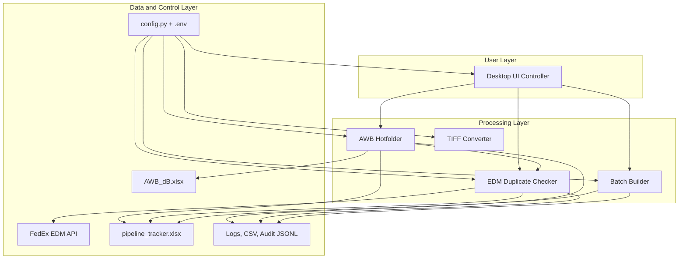

# AWB Pipeline: Senior Management Overview

**Audience:** Senior management, operations leaders, business stakeholders  
**Purpose:** Explain what the AWB Pipeline does, why it matters, how it reduces manual work and risk, and how to evaluate its business value.

## 1. Executive Summary

The AWB Pipeline is an automation system for processing shipment-related PDF documents. It performs three core jobs:

1. Identifies the Air Waybill (AWB) number from incoming files.
2. Checks whether the document already exists in FedEx EDM so duplicate content does not move forward.
3. Packages approved documents into print-ready batch files with barcode cover sheets for downstream handling.

In practical terms, the system replaces a slow and error-prone manual process with a controlled digital workflow that is faster, more consistent, easier to audit, and easier to scale.

## 2. Business Problem

Without automation, operators typically need to:

- open shipment PDFs manually
- locate the AWB number visually
- decide whether the document is new or already stored in EDM
- separate clean pages from duplicate pages
- prepare print batches in the correct sequence
- track what happened to each file

That creates several business risks:

- manual keying errors
- duplicate documents moving downstream
- clean documents being delayed by review effort
- inconsistent handling across operators
- weak traceability when questions arise later

## 3. Solution in One View

## 4. What the System Delivers

The current project delivers:

- automated AWB extraction from incoming PDFs
- duplicate detection against EDM using multiple matching methods
- automatic separation of duplicate and non-duplicate pages
- print-batch generation with barcode cover pages
- structured operational logging in Excel, CSV, and JSON audit files
- a desktop control panel for operations users
- cross-platform development support, with deployment intended for Windows

## 5. Why This Matters

### Speed

The pipeline removes repeated human steps such as opening files, reading AWB numbers, checking EDM manually, and assembling print groups by hand.

### Quality

The system does not rely on a single test. It combines filename checks, embedded text, OCR, exact image hashing, perceptual image hashing, and fuzzy text similarity to improve confidence.

### Control

Documents do not simply pass through unchecked. They are routed deliberately:

- to `PROCESSED` after AWB identification
- to `CLEAN` when safe to continue
- to `REJECTED` when duplicates are confirmed
- to `NEEDS_REVIEW` during AWB extraction when the system cannot confidently determine the AWB

### Auditability

The project keeps a detailed trail of:

- how a file was matched
- how long each stage took
- whether EDM had existing documents
- how many pages were rejected
- how many pages remained clean

## 6. What Makes the Pipeline Reliable

The design includes multiple safeguards:

- Filename shortcut for easy wins before expensive OCR.
- Excel-backed AWB validation so the system only accepts known AWBs in normal matching paths.
- Ambiguity handling that sends uncertain AWB cases to `NEEDS_REVIEW`.
- Duplicate-safe moves so files are not silently overwritten.
- FedEx EDM token validation and controlled stop behavior when the token expires.
- Buffered summary logging to reduce unnecessary file-write overhead.
- Batch-copy safety so original clean files are not deleted unless batch output copied successfully.
- Audit logging that does not interrupt production flow even if logging itself fails.

## 7. High-Level Operating Model

The user experience is intentionally simple:

- drop PDFs into `INBOX`
- start the watchers
- let the pipeline route files
- prepare print batches from the clean output

## 8. Key Business Outcomes by Stage

### Stage 1: AWB Extraction

Business outcome: every incoming file is either linked to a shipment AWB or isolated for review.

### Stage 2: EDM Duplicate Check

Business outcome: existing EDM content is prevented from moving downstream as if it were new work.

### Stage 3: Batch Preparation

Business outcome: operators receive organized, barcode-driven print batches instead of a loose collection of files.

## 9. Stakeholder View of Routing

| System Decision | Meaning for the Business |
|---|---|
| `PROCESSED` | AWB identified and file normalized for EDM lookup |
| `CLEAN` | Safe to continue into batching / downstream use |
| `REJECTED` | Duplicate content confirmed and held back |
| `PARTIAL-CLEAN` | Mixed file: duplicate pages removed, clean remainder preserved |
| `CLEAN-UNCHECKED` | Routed forward conservatively when a hard technical block prevented a full confirmation |
| `NEEDS_REVIEW` | AWB stage could not decide confidently and requires human inspection |

## 10. Reporting and Management Visibility

The project writes to existing operational files that can support management review:

- `AWB_Logs.xlsx`
  - AWB match results
  - EDM results
  - page counts including input pages, rejected pages, and true clean pages
- `pipeline_tracker.xlsx`
  - stage timestamps
  - active processing times
  - batch completion timing
- `pipeline_summary.csv`
  - consolidated summary rows for AWB + EDM processing
- `pipeline_audit.jsonl`
  - machine-readable event trail for deeper diagnostics

This means the project is not just automating work. It is also creating measurable operational data.

## 11. Visual Architecture

## 12. Current Design Philosophy

The project is deliberately conservative where a wrong decision could be costly.

Examples:

- It prefers human review over guessing when AWB identification is ambiguous.
- It uses layered duplicate checks rather than a single OCR result.
- It routes some technical edge cases as `CLEAN-UNCHECKED` instead of falsely rejecting work.
- It keeps detailed timing and audit data so tuning decisions can be evidence-based.

This is the right bias for an operational pipeline where accuracy matters as much as throughput.

## 13. Operational Dependencies

The system depends on:

- Python runtime and required libraries
- Tesseract OCR installation
- access to the FedEx EDM service
- a valid EDM token
- the local AWB master Excel database
- correct `.env` configuration on the deployed machine

These are normal operating dependencies, but they should be treated as production prerequisites.

## 14. Risks and Constraints

No automation system removes all risk. Current known boundaries include:

- OCR quality still depends on scan quality, orientation, and document clarity.
- EDM token expiration interrupts EDM checking until refreshed.
- Some scanned or TIFF-heavy EDM documents may require deeper OCR work.
- If a technical error happens during page stripping, the file is preserved and routed conservatively instead of being discarded.

These are controlled risks, not hidden risks.

## 15. Success Metrics to Track

Suggested metrics for management review:

- files processed per day
- percent matched automatically at AWB stage
- percent sent to `NEEDS_REVIEW`
- percent confirmed as duplicates in EDM
- percent partial-clean outcomes
- average active processing time per file
- batch output volume per day
- token-expiration incidents per period

These can be derived from the existing logs and tracker files.

## 16. Bottom Line

The AWB Pipeline is an operations automation platform, not just a script bundle.

It already provides:

- document intake automation
- quality-controlled duplicate detection
- structured downstream print preparation
- measurable operational traceability

For senior management, the core value is straightforward: it reduces manual handling, protects quality, improves consistency, and creates a cleaner operational control surface for shipment-document processing.
