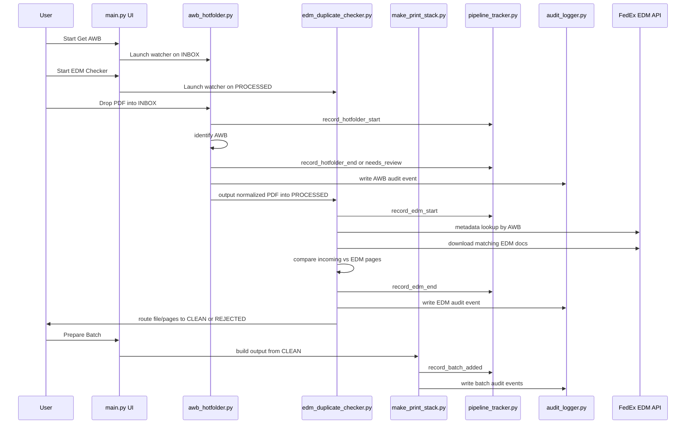
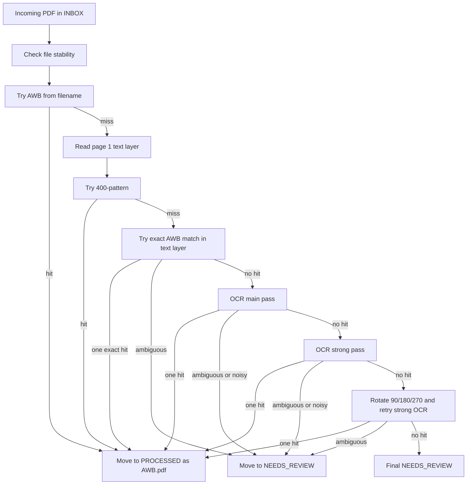
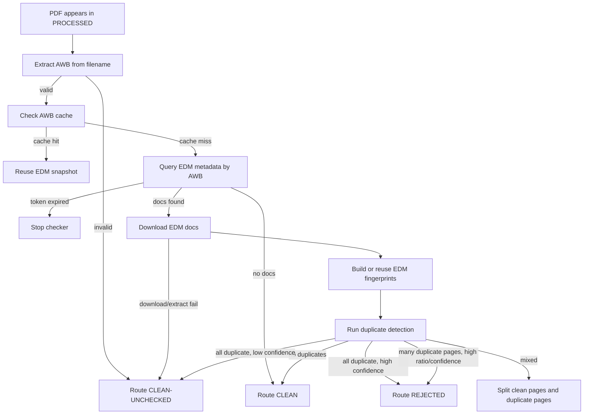
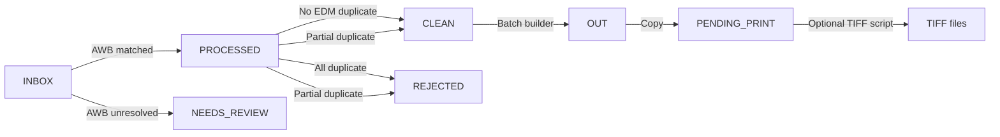

# AWB Pipeline: Technical Deep Dive

**Audience:** Technical leads, developers, support engineers, automation analysts  
**Purpose:** Document the current end-to-end behavior of the project in detail, including runtime folders, scripts, decision logic, routing rules, logs, and key safeguards.

## 1. System Purpose

The AWB Pipeline is a desktop-operated document-processing system for shipment PDFs. Its job is to:

1. read incoming PDF documents from a hot folder
2. determine the Air Waybill number (AWB)
3. rename and normalize the file into a processed state
4. look up the AWB in FedEx EDM
5. compare the local file against EDM documents to find duplicates
6. route the result into `CLEAN`, `REJECTED`, or a split clean/rejected outcome
7. build print-ready batch PDFs with barcode cover sheets
8. maintain logs, tracker data, and audit records

## 2. Top-Level Runtime Flow

## 3. Repository Map

| Path | Role |
|---|---|
| [`config.py`](/Users/gajjar/Desktop/AWB_PIPELINE/config.py) | Central runtime configuration loaded from `.env` |
| [`main.py`](/Users/gajjar/Desktop/AWB_PIPELINE/main.py) | Tkinter UI controller and process launcher |
| [`Scripts/awb_hotfolder.py`](/Users/gajjar/Desktop/AWB_PIPELINE/Scripts/awb_hotfolder.py) | AWB extraction and first-stage routing |
| [`Scripts/edm_duplicate_checker.py`](/Users/gajjar/Desktop/AWB_PIPELINE/Scripts/edm_duplicate_checker.py) | EDM lookup, duplicate detection, and final routing |
| [`Scripts/make_print_stack.py`](/Users/gajjar/Desktop/AWB_PIPELINE/Scripts/make_print_stack.py) | Builds barcode-based batch PDFs from clean output |
| [`Scripts/pdf_to_tiff_batch.py`](/Users/gajjar/Desktop/AWB_PIPELINE/Scripts/pdf_to_tiff_batch.py) | Optional PDF-to-TIFF conversion for print handoff |
| [`Scripts/pipeline_tracker.py`](/Users/gajjar/Desktop/AWB_PIPELINE/Scripts/pipeline_tracker.py) | Excel-based timing and lifecycle tracker |
| [`Scripts/audit_logger.py`](/Users/gajjar/Desktop/AWB_PIPELINE/Scripts/audit_logger.py) | JSONL event logger |

## 4. Runtime Directories and Files

These are created under `PIPELINE_BASE_DIR` from `.env`.

### Folders

| Folder | Purpose |
|---|---|
| `pdf_organizer/INBOX` | Raw incoming PDFs |
| `pdf_organizer/PROCESSED` | AWB-identified PDFs, renamed by AWB |
| `pdf_organizer/CLEAN` | Approved files or clean remainders |
| `pdf_organizer/REJECTED` | Duplicate files or duplicate-only page sets |
| `pdf_organizer/NEEDS_REVIEW` | AWB-stage unresolved files |
| `pdf_organizer/PENDING_PRINT` | Batch PDFs and optional TIFF handoff area |
| `data/OUT` | Print stack PDFs and AWB sequence workbook |
| `logs` | pipeline logs, EDM logs, audit log |

### Data Files

| File | Purpose |
|---|---|
| `data/AWB_dB.xlsx` | Master AWB reference list used by hotfolder matching |
| `data/AWB_Logs.xlsx` | AWB-stage and EDM-stage operational log |
| `data/pipeline_tracker.xlsx` | Active processing-time tracker |
| `data/stage_cache.csv` | Lightweight AWB-stage metadata cache used by EDM summary logging |
| `data/pipeline_summary.csv` | Buffered summary log of AWB + EDM outcomes |
| `data/token.txt` | Optional token override for EDM auth |
| `logs/pipeline.log` | AWB hotfolder and general pipeline text log |
| `logs/edm_checker.log` | EDM checker text log |
| `logs/pipeline_audit.jsonl` | JSON line audit events |

## 5. Configuration Model

Configuration is centralized in [`config.py`](/Users/gajjar/Desktop/AWB_PIPELINE/config.py). Machine-specific settings live in `.env`.

### Required Environment Variables

- `PIPELINE_BASE_DIR`
- `TESSERACT_PATH`

### Optional / Operational Variables

- `EDM_TOKEN`
- `EDM_OPERATING_COMPANY`
- OCR and refresh settings if overridden through `.env`

### Important Defaults

| Setting | Current Default |
|---|---|
| `OCR_DPI_MAIN` | `320` |
| `OCR_DPI_STRONG` | `420` |
| `ENABLE_ROTATION_LAST_RESORT` | `True` |
| `TEXT_SIMILARITY_THRESHOLD` | `50` |
| `PAGE_OCR_LIMIT` | `8` |
| `PHASH_THRESHOLD` | `10` |
| `EARLY_FOCUS_MATCH_THRESHOLD` | `3` |
| `MAX_PAGES_PER_BATCH` | `48` |
| `TIFF_DPI` | `200` |

### Cross-Platform Notes

- All filesystem paths are built with `pathlib.Path`.
- `main.py` opens folders using Windows, macOS, or Linux-specific shell actions based on platform.
- The intended runtime target is Windows, but the codebase is structured to be edited safely on macOS.

## 6. UI Layer (`main.py`)

[`main.py`](/Users/gajjar/Desktop/AWB_PIPELINE/main.py) is the operator control surface.

### Main Responsibilities

- create runtime directories at startup
- show folder counts and script statuses
- launch or stop the AWB hotfolder watcher
- launch or stop the EDM duplicate checker
- run batch preparation on demand
- support an auto mode
- open key runtime folders
- protect key files during clear operations

### Buttons and Their Meaning

| Button | Action |
|---|---|
| `Start Get AWB` | launches `awb_hotfolder.py` |
| `Start EDM Checker` | launches `edm_duplicate_checker.py` |
| `Prepare Batch` | runs `make_print_stack.py` once |
| `Clear All` | clears selected working outputs but preserves protected data |
| `Start AUTO MODE` | loops on wait-for-empty then batch |
| `Clear Log` | clears only the UI display widget |

### `Clear All` Behavior

`Clear All` is intentionally limited. It:

- stops AWB and EDM processes first if they are running
- deletes `awb_list.csv`
- clears working files from `INBOX`
- clears working files from `OUT`
- preserves `PROCESSED`, `CLEAN`, `REJECTED`, `NEEDS_REVIEW`
- preserves protected Excel files such as `AWB_dB.xlsx` and `AWB_Logs.xlsx`

### Auto Mode Logic

Auto mode runs this sequence:

1. ensure AWB hotfolder is running
2. ensure EDM checker is running
3. wait for `INBOX` to remain empty for a stable period
4. wait for `PROCESSED` to drain
5. run batch builder once
6. sleep for the configured interval
7. repeat until stopped

### Token-Expiry Behavior

If the EDM checker prints `TOKEN EXPIRED`, the UI:

- stops auto mode
- stops the AWB stage
- updates the status message
- shows a blocking error popup

This prevents more files from continuing into a state where they cannot be checked against EDM.

## 7. AWB Hotfolder Stage (`awb_hotfolder.py`)

[`Scripts/awb_hotfolder.py`](/Users/gajjar/Desktop/AWB_PIPELINE/Scripts/awb_hotfolder.py) watches the `INBOX` folder and tries to identify the AWB number for each PDF.

### Startup Behavior

On startup it:

1. ensures directories exist
2. verifies Tesseract exists
3. starts a watchdog observer on `INBOX`
4. loads AWBs from `AWB_dB.xlsx`
5. builds prefix and suffix buckets for faster fuzzy matching
6. performs a startup scan so already-present PDFs are processed
7. enters a loop that also performs periodic rescans and Excel refreshes

### Core Philosophy

- Use the cheapest and safest checks first.
- Do not emit normal matched output unless the AWB is trusted.
- Prefer `NEEDS_REVIEW` over guessing when ambiguous.
- Use OCR only after cheaper options.

### AWB Extraction Decision Order

### Detailed Step-by-Step Logic Per PDF

1. `file_is_stable()` checks the PDF size repeatedly before processing.
2. `record_hotfolder_start()` writes an in-progress tracker row.
3. `extract_awb_from_filename_strict()` looks for:
   - contiguous 12 digits
   - `1234 5678 9012` style spacing
4. If filename contains an AWB:
   - no Excel DB check is required
   - the file is logged as `Filename`
   - it is moved to `PROCESSED`
   - stage cache and tracker are updated
   - an audit event is written
5. If filename does not settle the match:
   - page 1 text layer is extracted with PyMuPDF
6. `extract_awb_from_400_pattern()` is tried first on text-layer text:
   - this allows `400-...` style numbers
   - this path can accept a 12-digit value immediately
7. If no `400` hit:
   - `extract_candidates_from_text()` pulls 12-digit candidates
   - candidates are intersected with the AWB Excel set
8. If exactly one text-layer AWB matches:
   - move to `PROCESSED`
   - log method `Text-Layer`
9. If multiple text-layer AWBs match and `STRICT_AMBIGUOUS` is enabled:
   - move to `NEEDS_REVIEW`
10. OCR main pass runs on page 1 rendered at `OCR_DPI_MAIN`:
   - preprocessing: grayscale, autocontrast, threshold
   - OCR digits-only with PSM 6 and 11
   - candidate extraction
11. If exactly one OCR-main AWB matches:
   - move to `PROCESSED`
12. If OCR-main is ambiguous:
   - move to `NEEDS_REVIEW`
13. If OCR-main yields many 12-digit candidates and `STOP_EARLY_IF_MANY_12DIGITS` is enabled:
   - move to `NEEDS_REVIEW`
14. If OCR-main yields only 1-2 candidates:
   - try fuzzy tolerance matching with `max_distance=2`
15. If still unresolved:
   - OCR strong pass runs on page 1 rendered at `OCR_DPI_STRONG`
   - it runs both normal and inverted threshold passes
16. Same exact / ambiguous / noisy / tolerance rules are applied to OCR strong results.
17. If still unresolved and `ENABLE_ROTATION_LAST_RESORT` is true:
   - rotate strong-rendered page `90`, `180`, and `270` degrees
   - run strong OCR on each rotated image
18. If all passes fail:
   - move to `NEEDS_REVIEW`
   - record the candidate numbers that were seen

### AWB Matching Support Logic

#### Candidate Extraction

The hotfolder extracts numeric candidates from:

- plain 12-digit sequences
- `#### #### ####`
- `400-...`
- `ACI-...`

#### Fuzzy Tolerance

Tolerance matching is limited and guarded:

- it only runs when candidate volume is low
- it uses prefix/suffix buckets when available
- it requires a unique best match by Hamming distance

### File Naming and Duplicate Handling

Matched files move into `PROCESSED` as:

- `123456789012.pdf`
- `123456789012_2.pdf`
- `123456789012_3.pdf`

If a destination file already exists:

- identical content removes the new source
- different content is versioned with `_2`, `_3`, etc.

### Hotfolder Logs and Outputs

For every handled PDF, the hotfolder may write to:

- `AWB_Logs.xlsx`
- `stage_cache.csv`
- `pipeline_tracker.xlsx`
- `pipeline.log`
- `pipeline_audit.jsonl`

## 8. EDM Duplicate Checker (`edm_duplicate_checker.py`)

[`Scripts/edm_duplicate_checker.py`](/Users/gajjar/Desktop/AWB_PIPELINE/Scripts/edm_duplicate_checker.py) watches `PROCESSED` and checks each normalized file against EDM documents for the same AWB.

### Startup Behavior

On startup it:

1. ensures directories exist
2. resolves the EDM token
   - `data/token.txt` takes priority
   - `.env` `EDM_TOKEN` is second
3. exits cleanly if no token is available
4. logs watched folders and thresholds
5. processes any PDFs already sitting in `PROCESSED`
6. starts a watchdog observer for newly created PDFs

### AWB Resolution Rule

AWB is read from the processed filename using `_awb_from_processed_filename()`.

Examples:

- `123456789012.pdf` -> `123456789012`
- `123456789012_2.pdf` -> `123456789012`
- `123456789012_3.pdf` -> `123456789012`

This means suffixes do not affect the EDM query AWB.

### High-Level EDM Flow

## 9. EDM API Logic

### Metadata Lookup

`get_document_ids(awb)` posts to the FedEx metadata endpoint with:

- `documentClass = SHIPMENT`
- `operatingCompany`
- `trackingNumber = [awb]`

Behavior:

- `401` -> token expired -> returns `None`
- `404` -> no EDM docs -> returns `[]`
- non-200 other than above -> warning and empty result
- `200` -> extracts document IDs from returned groups/documents

### Download

`download_edm_zip(doc_ids)`:

1. requests a ZIP for all document IDs
2. if ZIP contains supported docs, returns ZIP bytes
3. if ZIP is empty, retries each document individually
4. if a direct PDF is returned, wraps it into a ZIP-like flow

### TIFF Handling

If EDM returns TIFFs:

- TIFF frames are converted to PDF pages in memory
- those PDFs are then compared like any other EDM PDF

This matters because the EDM side may not always be born-digital PDFs.

## 10. AWB-Level EDM Cache

The checker uses `AWB_SESSION_CACHE` for the current AWB only.

Cached items:

- current AWB
- EDM document IDs
- downloaded EDM PDFs
- precomputed EDM fingerprints

Cache is cleared when processing moves to a different AWB.

Benefit:

- repeated files for the same AWB do not re-download and re-fingerprint EDM documents unnecessarily

## 11. EDM Fingerprints

`build_edm_fingerprints()` precomputes cheap, reusable per-document signals:

- `page_count`
- exact page hash map
- perceptual hashes
- embedded text per page
- top numeric tokens extracted from embedded text

These signals are used to reduce the number of EDM docs that need deeper checking.

## 12. Duplicate Detection Logic in Exact Order

The core duplicate engine is `find_duplicate_pages()`.

### 12.1 Initialization

It prepares:

- incoming pages from the local PDF
- lazy EDM document handles
- caches for incoming hash, phash, embedded text, OCR text
- caches for EDM OCR text
- match counts per EDM doc
- per-page duplicate detail structure

### 12.2 Cargo Control Document Exemption

Each incoming page is checked by `page_is_cargo_control_document()`.

A page is exempt if:

- text indicates `CARGO CONTROL DOCUMENT` or French equivalent
- and it also contains a `400`-style number

Exempt pages are skipped from duplicate evaluation.

### 12.3 Conservative EDM Doc Prefilter

Before expensive comparisons, the checker scores EDM docs with cheap signals:

- exact hash overlap count
- near-phash overlap count
- page-count proximity
- top numeric token overlap from embedded text

Rules:

- if EDM set size is `<= 3`, keep all docs
- otherwise keep docs if:
  - they have exact hash overlap, or
  - enough phash hits, or
  - enough token overlap, or
  - they rank inside the top-N combined score set
- only skip docs that are clearly cold

This prunes obviously unrelated EDM docs while preserving conservative safety.

### 12.4 Focus Mechanism

If one EDM document accumulates at least `EARLY_FOCUS_MATCH_THRESHOLD` page matches, the checker focuses remaining comparisons on that EDM doc.

Current default threshold: `3`

This reduces unnecessary comparison permutations once an obvious matching EDM doc emerges.

### 12.5 Stage 1: Exact Hash

For each non-exempt incoming page:

- render at 100 DPI
- MD5 the pixmap bytes
- compare against EDM hash maps

If exact hash matches:

- page is marked duplicate immediately
- method = `HASH`

This is the strongest and cheapest duplicate signal.

### 12.6 Stage 2: Perceptual Hash

For remaining pages:

- compute image perceptual hash
- compare against EDM phashes
- accept if difference `<= PHASH_THRESHOLD`

Current threshold: `10`

If matched:

- page is marked duplicate
- method = `PHASH`

This is meant to catch visually similar pages where exact bytes differ.

### 12.7 Stage 3: Embedded Text Similarity

For pages still unresolved:

- extract full-page embedded text
- compare to EDM full-page embedded text
- if either side lacks usable text, mark that OCR may be needed
- use `rapidfuzz` and keep the best text similarity score

If score `>= TEXT_SIMILARITY_THRESHOLD`:

- page is marked duplicate
- method = `TEXT`

Current threshold: `50`

### 12.8 Stage 4: OCR Fallback

OCR is not always run immediately. It is controlled by an OCR gate.

#### When OCR Gate Is Considered

OCR quick-check is considered if:

- earlier text comparison needed OCR because text was missing, or
- there are no non-OCR match signals at all

#### OCR Quick-Indication Window

The quick gate checks:

- incoming pages `1-3`
- against EDM pages `1-5`

Priority order:

1. incoming page 1 vs page 1 of each EDM doc
2. then incoming pages 1-3 vs EDM pages 1-5

If similarity passes threshold, the checker has enough indication to justify full OCR comparison.

#### OCR Safety Net

Even if the quick gate does not hit, OCR can still run if:

- earlier non-OCR signals are already concentrated on one EDM document

This avoids losing borderline duplicates just because the quick window missed them.

#### Full OCR Scope

- If no non-OCR signals exist at all:
  - OCR escalates to all pages
  - `ocr_max_pages = None`
- Otherwise:
  - OCR stays capped to `OCR_COMPARE_LIMIT`

Current compare limit: `10`

If OCR comparison matches:

- page is marked duplicate
- method = `OCR`

## 13. Duplicate Confidence and Routing

After all duplicate methods run, the checker computes:

- duplicate page count
- duplicate ratio
- rejection confidence tier

### Confidence Tiers

`_rejection_confidence()` evaluates method counts:

- `HIGH`
  - at least one exact hash match, or
  - enough combined phash + text/OCR evidence
- `MEDIUM`
  - multiple phash hits, or
  - combined text/OCR with some phash support
- `LOW`
  - weak evidence only

### Final Routing Rules

#### Case 1: No Duplicate Pages

- route whole file to `CLEAN`
- append clean CSV row
- log EDM result to Excel

#### Case 2: All Pages Duplicate

- if confidence is `LOW`
  - route whole file to `CLEAN`
  - mark status `CLEAN-UNCHECKED`
- else
  - route whole file to `REJECTED`

#### Case 3: More Than Threshold Duplicate Pages and High Ratio

If:

- `dup_count > REJECT_IF_DUP_PAGES_OVER`
- and `dup_ratio >= REJECT_IF_DUP_RATIO`
- and confidence is not `LOW`

then:

- route whole file to `REJECTED`

Current thresholds:

- `REJECT_IF_DUP_PAGES_OVER = 5`
- `REJECT_IF_DUP_RATIO = 0.70`

#### Case 4: Mixed File

If some pages are duplicate and some are not:

- build one PDF containing clean pages
- build one PDF containing duplicate pages
- move clean remainder to `CLEAN`
- move duplicate-only PDF to `REJECTED`
- status = `PARTIAL-CLEAN`

If that split/save operation fails:

- preserve original file
- route it as `CLEAN-UNCHECKED`

### EDM Route Philosophy

The EDM stage does not currently send files to `NEEDS_REVIEW`.

- `NEEDS_REVIEW` is an AWB-stage route for unresolved identification
- EDM uncertainty or technical failure routes as `CLEAN-UNCHECKED`
- confirmed duplicate cases route to `REJECTED`

## 14. EDM Logging Outputs

The EDM checker writes to multiple outputs.

### `AWB_Logs.xlsx`

Main AWB sheet receives EDM result rows with:

- AWB
- source file
- timestamp
- `MatchMethod = EDM-Check`
- status
- reason
- match stats
- `Input_Page_Count`
- `Rejected_Page_Count`
- `True_Clean_Page_Count`
- `Rejected_Pages`
- `True_Clean_Pages`

Rejected sheet receives:

- AWB
- source file
- timestamp
- reason
- match stats

### `pipeline_summary.csv`

Buffered summary rows include:

- input filename
- AWB detected
- AWB detection type
- EDM check status
- duplicate detection methods
- score summary
- AWB extraction seconds
- EDM check minutes
- total combined minutes
- total pages
- rejected page count
- true clean page count
- duplicate page numbers
- clean page numbers
- decision trace

### `pipeline_audit.jsonl`

Each EDM event includes:

- file
- AWB
- status
- route
- reason
- match stats
- timings
- cache hit/miss

## 15. Batch Builder (`make_print_stack.py`)

[`Scripts/make_print_stack.py`](/Users/gajjar/Desktop/AWB_PIPELINE/Scripts/make_print_stack.py) reads the `CLEAN` folder and produces print-ready batches.

### Source Assumption

The batch builder treats the `CLEAN` folder as the source of truth.

### Main Steps

1. ensure runtime directories exist
2. verify `reportlab` is installed
3. scan `CLEAN` for files named:
   - `123456789012.pdf`
   - `123456789012_2.pdf`
   - etc.
4. group all files by AWB
5. sort each AWB group by file modification time
6. count readable pages in each file
7. create one logical record per AWB containing:
   - sequence number
   - AWB
   - file list
   - document count
   - invoice page count
   - total pages including cover
8. precompute batch allocation based on `MAX_PAGES_PER_BATCH`
9. generate one barcode cover page per AWB
10. insert cover + all grouped PDFs into a batch PDF
11. save batch PDFs in `data/OUT`
12. write `awb_sequence.xlsx`
13. copy batch PDFs to `PENDING_PRINT`
14. delete `CLEAN` source files only if copy-to-`PENDING_PRINT` succeeded for all outputs

### Cover Page Contents

Each AWB gets a cover page containing:

- sequence number
- AWB
- batch number
- page position within batch
- documents count
- invoice page count
- Code128 barcode
- timestamp

### Safety Rule

If not all generated batch PDFs copy successfully to `PENDING_PRINT`, the source clean PDFs are not deleted.

## 16. TIFF Conversion (`pdf_to_tiff_batch.py`)

[`Scripts/pdf_to_tiff_batch.py`](/Users/gajjar/Desktop/AWB_PIPELINE/Scripts/pdf_to_tiff_batch.py) is an optional downstream utility, not part of the UI-driven core watcher chain.

It:

- scans `PENDING_PRINT` for PDFs
- renders each page at configured DPI
- optionally converts to grayscale
- saves a multi-page TIFF beside the original PDF
- can skip TIFFs that already exist

This script is useful when downstream print hardware or workflow expects TIFF output.

## 17. Tracker (`pipeline_tracker.py`)

[`Scripts/pipeline_tracker.py`](/Users/gajjar/Desktop/AWB_PIPELINE/Scripts/pipeline_tracker.py) maintains `pipeline_tracker.xlsx`.

### Tracked Milestones

- `record_hotfolder_start()`
- `record_hotfolder_end()`
- `record_hotfolder_needs_review()`
- `record_edm_start()`
- `record_edm_end()`
- `record_batch_added()`

### Tracker Columns

- AWB
- original filename
- processed filename
- hotfolder start/end
- hotfolder seconds
- match method
- EDM start/end
- EDM seconds
- EDM result
- batch time
- batch number
- total processing seconds
- total processing HMS
- status
- notes

### Status Interpretation

- `IN-PROGRESS`
- `REJECTED`
- `NEEDS-REVIEW`
- `COMPLETE`

The tracker intentionally measures active processing time, not all wall-clock waiting.

## 18. Audit Logger (`audit_logger.py`)

[`Scripts/audit_logger.py`](/Users/gajjar/Desktop/AWB_PIPELINE/Scripts/audit_logger.py) appends one JSON object per event to `pipeline_audit.jsonl`.

Key property:

- audit logging never throws back into the pipeline flow if writing fails

This keeps the pipeline operational even during transient logging issues.

## 19. End-to-End Folder Lifecycle

## 20. Important Naming Rules

### Input Stage

Raw files can have arbitrary names, but AWB extraction from filename benefits from obvious 12-digit forms.

### Processed Stage

Files are normalized to:

- `AWB.pdf`
- `AWB_2.pdf`
- `AWB_3.pdf`

### EDM Lookup Rule

Only the base 12-digit AWB is used for EDM lookup. Suffixes are ignored.

## 21. Current Safeguards Summary

| Safeguard | Where |
|---|---|
| file stability check | AWB hotfolder |
| ambiguity routing | AWB hotfolder |
| noisy-candidate early stop | AWB hotfolder |
| rotated OCR fallback | AWB hotfolder |
| token-expiry hard stop | EDM checker + UI |
| AWB-scoped EDM cache | EDM checker |
| conservative EDM prefilter | EDM checker |
| OCR quick-indication gate | EDM checker |
| confidence-based reject routing | EDM checker |
| duplicate-safe file moves | AWB + EDM stages |
| buffered summary logging | EDM checker |
| safe source deletion after copy success | Batch builder |
| non-blocking audit writes | all stages |

## 22. Operational Edge Cases

### Invalid Processed Filename

If a file reaches EDM stage with an invalid filename format:

- it cannot derive a reliable AWB
- it routes as `CLEAN-UNCHECKED`

### Missing EDM Token

If no token is available:

- checker exits at startup
- no EDM processing begins

### Token Expired Mid-Run

If metadata lookup returns `401`:

- checker logs `TOKEN EXPIRED`
- process exits
- UI halts AWB and auto mode

### TIFF EDM Content

If EDM returns TIFF files:

- they are converted to PDFs in memory
- then compared normally

### Page-Splitting Failure

If partial-clean splitting fails:

- original file is preserved
- routed as `CLEAN-UNCHECKED`

## 23. Dependencies

From [`requirements.txt`](/Users/gajjar/Desktop/AWB_PIPELINE/requirements.txt):

- `PyMuPDF`
- `Pillow`
- `pytesseract`
- `openpyxl`
- `python-dotenv`
- `requests`
- `watchdog`
- `rapidfuzz`
- `reportlab`
- `opencv-python-headless`
- `numpy`
- `ImageHash`

## 24. What Is Manual vs Automatic

### Automatic

- watch `INBOX`
- match AWB
- rename and move to `PROCESSED`
- watch `PROCESSED`
- query EDM
- compare and route pages/files
- log results

### Operator-Triggered

- starting and stopping the watchers
- starting auto mode
- preparing print batches
- running TIFF conversion if needed
- resolving `NEEDS_REVIEW`
- refreshing EDM token when expired

## 25. Recommended Mental Model for Support and Tuning

When debugging or tuning this system, think in this order:

1. configuration and token availability
2. folder state and file naming
3. AWB-stage match path used
4. stage cache and tracker row existence
5. EDM metadata result
6. EDM download and extract success
7. duplicate detection method that actually fired
8. final routing rule that applied
9. batch safety and copy success

That ordering mirrors the real control flow of the application.

## 26. Bottom Line for Technical Readers

The project is a multi-stage, watchdog-driven document pipeline with conservative routing logic, layered duplicate detection, and several operational safety nets. The most important things to remember are:

- AWB extraction and EDM checking are intentionally separate stages
- processed filenames are the contract between those stages
- EDM duplicate detection uses exact hash, perceptual hash, embedded text, and gated OCR in that order
- routing is confidence-aware, not just match-count aware
- batching only consumes `CLEAN`
- logs and tracker files are first-class outputs, not afterthoughts
